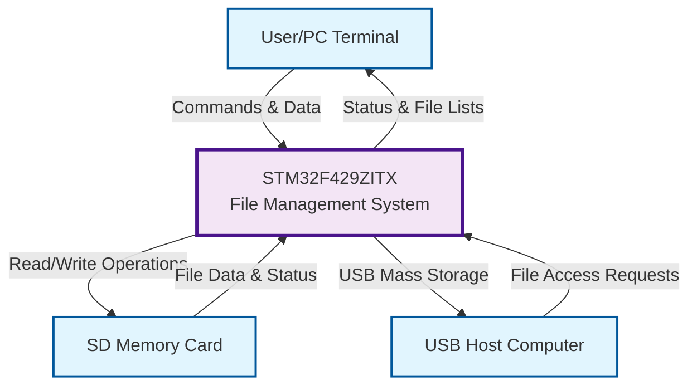

# DFD Level 0 - Context Diagram

## STM32 SD Card File Management System

## System Description:

- **STM32F429ZITX**: Main microcontroller handling file operations
- **User/PC Terminal**: Provides commands via UART interface
- **SD Memory Card**: Stores files and directories
- **USB Host Computer**: Accesses files through USB mass storage interface

## Main Data Flows:

1. **User Commands**: File operations (create, delete, list, update)
2. **File Data**: Read/write operations between STM32 and SD card
3. **Status Information**: System responses and file lists
4. **USB Storage**: Mass storage interface for external access
