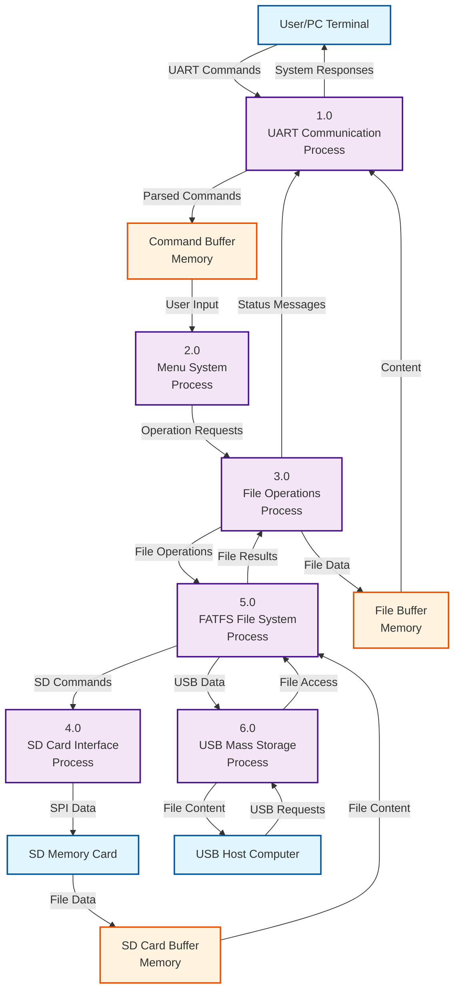

# DFD Level 1 - Detailed System Decomposition

## STM32 SD Card File Management System

## Process Descriptions:

### 1.0 UART Communication Process

- **Input**: User commands via UART
- **Output**: Parsed commands to command buffer
- **Functions**:
  - `uart_receive_string()` - Receive user input
  - `uart_receive_char()` - Receive single character
  - `send_uart()` - Send responses to user

### 2.0 Menu System Process

- **Input**: Parsed commands from command buffer
- **Output**: Operation requests to file operations
- **Functions**:
  - Menu display and option selection
  - Command validation and routing

### 3.0 File Operations Process

- **Input**: Operation requests from menu system
- **Output**: File operation requests to FATFS
- **Functions**:
  - File creation, deletion, listing
  - Directory creation and deletion
  - File content updates

### 4.0 SD Card Interface Process

- **Input**: SD commands from FATFS
- **Output**: SPI data to SD card
- **Functions**:
  - `SD_disk_initialize()` - Initialize SD card
  - `SD_disk_read()` - Read sectors
  - `SD_disk_write()` - Write sectors
  - SPI communication protocols

### 5.0 FATFS File System Process

- **Input**: File operations from file operations process
- **Output**: SD commands to SD interface
- **Functions**:
  - `f_mount()` - Mount file system
  - `f_open()`, `f_close()` - File handling
  - `f_read()`, `f_write()` - File I/O
  - `f_mkdir()`, `f_unlink()` - Directory operations

### 6.0 USB Mass Storage Process

- **Input**: USB requests from host computer
- **Output**: File access to FATFS
- **Functions**:
  - USB MSC (Mass Storage Class) interface
  - File system emulation for USB host

## Data Stores:

- **File Buffer**: Temporary storage for file content
- **Command Buffer**: Storage for parsed user commands
- **SD Buffer**: Buffer for SD card data transfer
