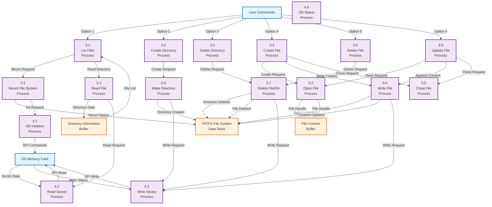

# DFD Level 2 - File Operations Detail

## Detailed File Management Processes

## Detailed Process Descriptions:

### 3.1 List Files Process

- **Input**: User selection for file listing
- **Output**: File and directory list
- **Functions**: `SD_List_File()`
- **Data Flow**: Mount → Read Directory → Display Files

### 3.2 Create Directory Process

- **Input**: Directory name from user
- **Output**: New directory created
- **Functions**: `SD_creatSubDir()`
- **Data Flow**: Validate → Create → Mount → Verify

### 3.3 Delete Directory Process

- **Input**: Directory name to delete
- **Output**: Directory and contents deleted
- **Functions**: `SD_deleteFolder()`, `delete_node()`
- **Data Flow**: Open Directory → Delete Contents → Delete Directory

### 3.4 Create File Process

- **Input**: File name and content
- **Output**: New file created with content
- **Functions**: `f_open()`, `f_write()`, `f_close()`
- **Data Flow**: Create File → Write Content → Close File

### 3.5 Delete File Process

- **Input**: File name to delete
- **Output**: File deleted
- **Functions**: `f_unlink()`
- **Data Flow**: Validate → Delete → Update File System

### 3.6 Update File Process

- **Input**: File name and new content
- **Output**: File updated with appended content
- **Functions**: `f_open()`, `f_lseek()`, `f_puts()`, `f_close()`
- **Data Flow**: Open File → Seek to End → Append → Close

## FATFS Sub-Processes:

### 5.1 Mount File System

- **Function**: `f_mount(&fs, "/", 1)`
- **Purpose**: Initialize and mount FAT file system

### 5.2-5.5 File I/O Operations

- **Open**: `f_open()` - Open file for read/write
- **Read**: `f_read()` - Read file content
- **Write**: `f_write()` - Write data to file
- **Close**: `f_close()` - Close file handle

### 5.6-5.7 Directory Operations

- **Make Directory**: `f_mkdir()` - Create new directory
- **Delete**: `f_unlink()` - Delete file or directory

## SD Card Sub-Processes:

### 4.1 SD Initialize

- **Function**: `SD_disk_initialize()`
- **Purpose**: Initialize SD card and SPI interface

### 4.2-4.3 Sector Operations

- **Read Sector**: `SD_disk_read()` - Read 512-byte sectors
- **Write Sector**: `SD_disk_write()` - Write 512-byte sectors

### 4.4 SD Status

- **Function**: `SD_disk_status()`
- **Purpose**: Check SD card status and errors
