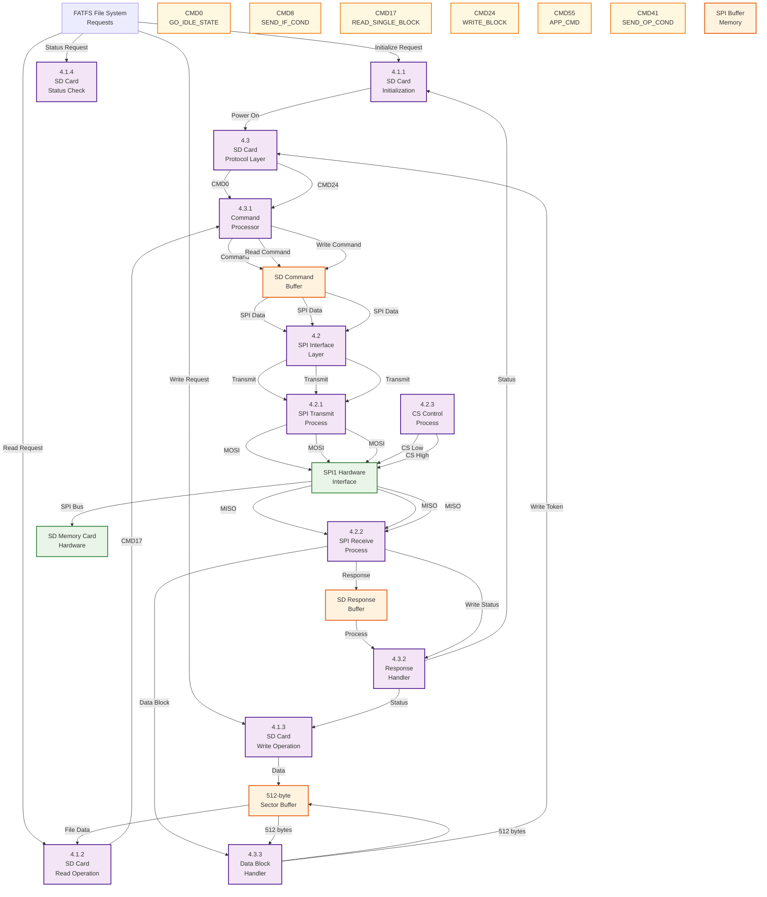

# DFD Level 3 - SD Card Communication Detail

## SPI Communication and SD Card Protocol

## Detailed SD Card Communication Process:

### 4.1 SD Card Operations

#### 4.1.1 SD Card Initialization

- **Purpose**: Initialize SD card and establish communication
- **Sequence**:
  1. Power on sequence (10 dummy bytes)
  2. Send CMD0 (GO_IDLE_STATE)
  3. Send CMD8 (SEND_IF_COND) - Check SD version
  4. Send CMD55 + CMD41 (ACMD41) - Initialize card
  5. Read OCR register (CMD58) - Check capacity

#### 4.1.2 SD Card Read Operation

- **Purpose**: Read 512-byte sector from SD card
- **Sequence**:
  1. Send CMD17 (READ_SINGLE_BLOCK)
  2. Wait for data token (0xFE)
  3. Read 512 bytes of data
  4. Read 2-byte CRC
  5. Deselect card

#### 4.1.3 SD Card Write Operation

- **Purpose**: Write 512-byte sector to SD card
- **Sequence**:
  1. Wait for card ready (0xFF)
  2. Send CMD24 (WRITE_BLOCK)
  3. Send data token (0xFE)
  4. Send 512 bytes of data
  5. Send 2-byte CRC
  6. Wait for write response
  7. Wait for write completion

#### 4.1.4 SD Card Status Check

- **Purpose**: Check SD card status and errors
- **Functions**: `SD_disk_status()`

### 4.2 SPI Interface Layer

#### 4.2.1 SPI Transmit Process

- **Function**: `SPI_TxByte()`, `SPI_TxBuffer()`
- **Purpose**: Transmit data to SD card via SPI
- **Hardware**: SPI1 (MOSI, SCK, CS)

#### 4.2.2 SPI Receive Process

- **Function**: `SPI_RxByte()`, `SPI_RxBytePtr()`
- **Purpose**: Receive data from SD card via SPI
- **Hardware**: SPI1 (MISO, SCK, CS)

#### 4.2.3 CS Control Process

- **Function**: `SELECT()`, `DESELECT()`
- **Purpose**: Control chip select signal
- **Hardware**: PC4 (Chip Select)

### 4.3 SD Card Protocol Layer

#### 4.3.1 Command Processor

- **Function**: `SD_SendCmd()`
- **Purpose**: Format and send SD commands
- **Command Format**: 6 bytes (CMD + ARG + CRC)

#### 4.3.2 Response Handler

- **Purpose**: Process SD card responses
- **Response Types**: R1, R3, R7 (status responses)

#### 4.3.3 Data Block Handler

- **Functions**: `SD_RxDataBlock()`, `SD_TxDataBlock()`
- **Purpose**: Handle 512-byte data blocks
- **Tokens**: 0xFE (data), 0xFC (multiple write), 0xFD (stop)

## Key SD Commands:

### CMD0 - GO_IDLE_STATE

- **Purpose**: Reset SD card to idle state
- **Argument**: 0x00000000
- **CRC**: 0x95

### CMD8 - SEND_IF_COND

- **Purpose**: Check SD card interface condition
- **Argument**: 0x000001AA
- **CRC**: 0x87

### CMD17 - READ_SINGLE_BLOCK

- **Purpose**: Read single 512-byte block
- **Argument**: Sector address

### CMD24 - WRITE_BLOCK

- **Purpose**: Write single 512-byte block
- **Argument**: Sector address

### CMD55 - APP_CMD

- **Purpose**: Application-specific command prefix
- **Argument**: 0x00000000

### CMD41 - SEND_OP_COND

- **Purpose**: Initialize SD card
- **Argument**: HCS bit (0x40000000 for SDHC)

## Hardware Configuration:

- **SPI1**: Master mode, 8-bit data, MSB first
- **Baud Rate**: SPI_BAUDRATEPRESCALER_32
- **Pins**:
  - PA5: SCK (SPI1_SCK)
  - PA6: MISO (SPI1_MISO)
  - PA7: MOSI (SPI1_MOSI)
  - PC4: CS (Chip Select)
